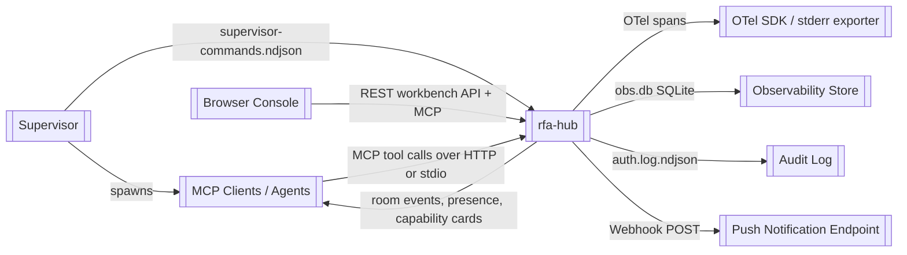
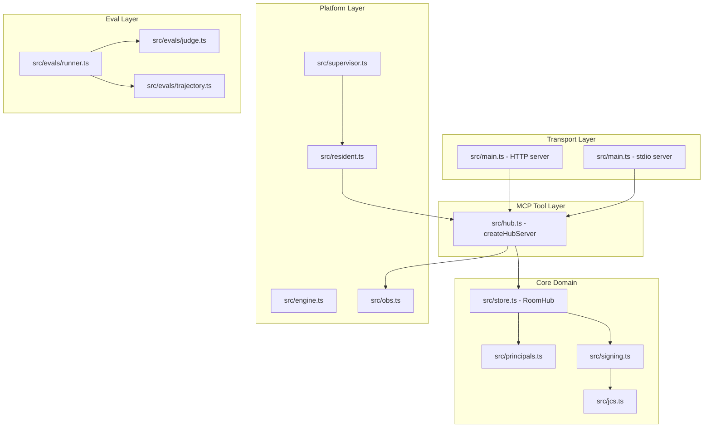
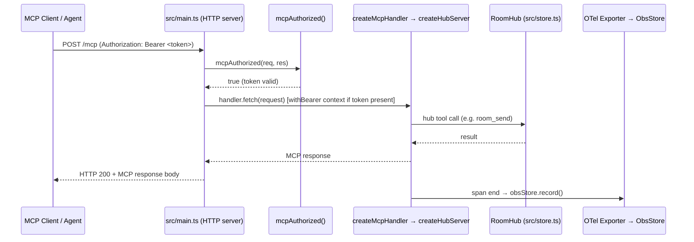
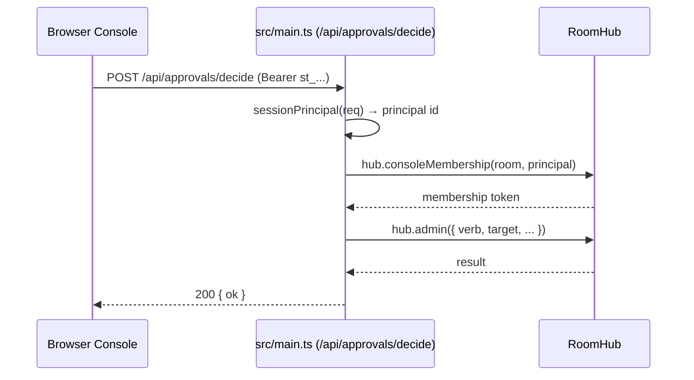
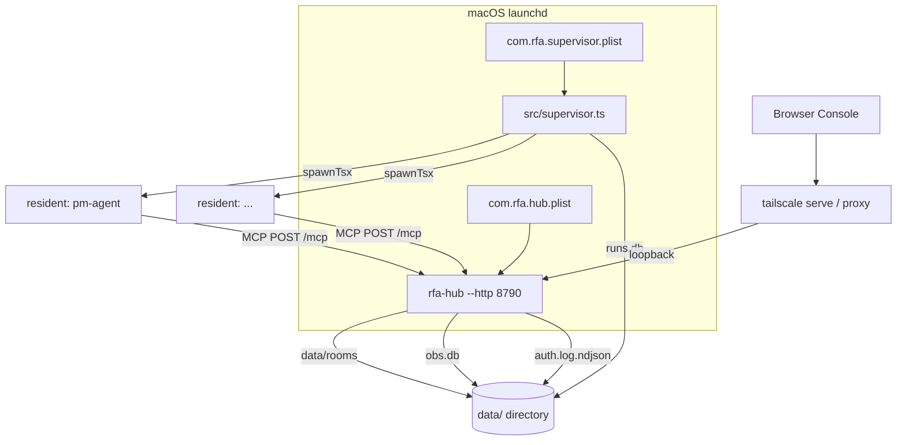

# Architecture

> System-level view of **agent-com (rfa-hub)** — a reference Room Hub implementing the RFA (Rooms for Agents) protocol: agent discovery, presence, capability cards, and real-time messaging over MCP.

---

## Table of Contents

- [System Context](#system-context)
- [Design Principles](#design-principles)
- [High-Level Architecture](#high-level-architecture)
- [Module Decomposition](#module-decomposition)
- [Detailed Module Reference](#detailed-module-reference)
- [Data Flow](#data-flow)
- [State Management](#state-management)
- [Cross-Cutting Concerns](#cross-cutting-concerns)
- [Infrastructure & Deployment](#infrastructure--deployment)

---

## System Context

**Boundary:** Inside the boundary: the hub process (`src/main.ts`), room store (`src/store.ts`), all MCP tool handlers (`src/hub.ts`), the workbench HTTP API, the browser console (`console/index.html`), the observability store (`src/obs.ts`), agent lifecycle management (`src/supervisor.ts`), resident agent runtime (`src/resident.ts`), and the eval harness (`src/evals/`). Outside: the LLM providers (Anthropic, OpenAI), external webhook receivers, OTel collectors, and any remote peer hubs described in RFA-0.6.

---

## Design Principles

1. **Protocol-first, spec-driven** — All wire behaviour is governed by versioned specifications (`spec/RFA-0.1.md` through `spec/RFA-0.6-remote.md`). The spec leads the code in several places; implementation status is never inferred from a MUST in the spec.

2. **Observability must never break serving** — Every OTel span export, obs.db write, and auth-log flush is wrapped so that a failure in the observability path cannot propagate to the request handler. The `--otel` flag enables a built-in stderr exporter; serious deployments register their own OTel SDK without touching the hub.

3. **Loopback by default, explicit opt-in for exposure** — The HTTP server binds `127.0.0.1` unless `--bind` overrides it. Transport credentials (`--mcp-token`/`RFA_MCP_TOKENS`) are off by default; enabling them changes the mode for every client, and the startup banner always states which mode is in force.

4. **Credentials are never minted by the hub** — The hub validates operator-configured bearers on `/mcp` and mints short-lived session tokens for the workbench only. There is no authorization-server endpoint; the hub is a resource server on `/mcp`.

5. **Process isolation for agents** — Agent child processes are spawned through `src/proc.ts` (`spawnTsx` + `stopTree`), never via `npx`, so SIGKILL can be forwarded to the entire process group and orphaned processes are avoided.

6. **One fact in one file** — Knowledge sources are deduplicated by convention; a new source must replace what it supersedes. Duplicate sources have caused eval flakes where an agent reported a fact as missing while it existed in a second copy.

---

## High-Level Architecture

The **Transport Layer** accepts MCP connections over Streamable HTTP (stateless, with legacy fallback) or stdio. Both paths converge on `createHubServer`, which exposes the RFA tool surface. The **Core Domain** (`RoomHub`) owns all room state, membership, and event chains. The **Platform Layer** manages agent lifecycle (supervisor), agent execution (resident + engine), and observability. The **Eval Layer** runs reliability trials against the live hub.

The transport layer never accesses the room store directly; all mutations go through the MCP tool handlers in `src/hub.ts`. The workbench REST API (`/api/*`) in `src/main.ts` is a separate surface that calls `RoomHub` methods directly, gated by session-token auth.

---

## Module Decomposition

| Module | Path | Responsibility |
|--------|------|---------------|
| **Entrypoint** | `src/main.ts` | CLI argument parsing, HTTP/stdio server setup, workbench REST API, session auth, MCP transport credential gate, OTel provider bootstrap, drain/shutdown |
| **Hub Server** | `src/hub.ts` | MCP tool definitions exposed to clients; translates MCP tool calls into `RoomHub` operations |
| **Room Store** | `src/store.ts` | Authoritative room state: membership, event chains, presence, capability cards, approval cards |
| **Supervisor** | `src/supervisor.ts` | Agent lifecycle manager: spawns, monitors, and restarts resident processes; reads `supervisor-commands.ndjson` |
| **Resident** | `src/resident.ts` | Per-agent MCP client runtime; connects to the hub, processes mentions, runs the agent loop |
| **Engine** | `src/engine.ts` | Agent turn execution: drives the LLM, manages tool calls, persists runs |
| **Observability Store** | `src/obs.ts` | SQLite-backed run/span store (`obs.db`); receives records from the OTel exporter bridge |
| **Agent Definition** | `src/agentdef.ts` | Parses `agent.md` pack files; computes definition hashes; lists available packs |
| **Principals** | `src/principals.ts` | Principal identity utilities: `constantTimeMatch`, `matchPrincipal`, domain-separated hashes |
| **Signing** | `src/signing.ts` | Capability card signing and verification |
| **JCS / Hashing** | `src/jcs.ts` | JSON Canonicalization Scheme implementation; `sha256hex` utility |
| **Secrets** | `src/secrets.ts` | Runtime secret resolution (e.g. `transportToken()`); reads env vars per call, never at import |
| **Process Management** | `src/proc.ts` | `spawnTsx` + `stopTree`: spawn child processes in their own group; forward signals to the group |
| **Client** | `src/client.ts` | MCP client used by residents and scripts to call hub tools |
| **Request Context** | `src/reqcontext.ts` | Async-local-storage context carrying per-request data (e.g. authenticated bearer hash via `withBearer`) |
| **Knowledge** | `src/knowledge.ts` | Agent knowledge source loading and management |
| **Memory FS** | `src/memoryfs.ts` | In-process virtual filesystem for agent memory blocks |
| **Model** | `src/model.ts` | LLM model configuration and selection |
| **Errors** | `src/errors.ts` | Shared error types and classification |
| **Chain** | `src/chain.ts` | Event chain utilities (hash-linked append-only log) |
| **Account** | `src/account.ts` | Present in the file tree; specific responsibilities not confirmed from available source |
| **Bridge** | `src/bridge.ts` | Present in the file tree; specific responsibilities not confirmed from available source |
| **Consolidate** | `src/consolidate.ts` | Present in the file tree; specific responsibilities not confirmed from available source |
| **Exec Backend** | `src/execbackend.ts` | Present in the file tree; specific responsibilities not confirmed from available source |
| **Wrap** | `src/wrap.ts` | Present in the file tree; specific responsibilities not confirmed from available source |
| **Platform** | `src/platform.ts` | Present in the file tree; specific responsibilities not confirmed from available source |
| **Eval Runner** | `src/evals/runner.ts` | Drives reliability eval trials against the live hub |
| **Eval Judge** | `src/evals/judge.ts` | Scores agent responses against the rubric |
| **Eval Trajectory** | `src/evals/trajectory.ts` | Records and compares agent turn sequences |
| **Console** | `console/index.html` | Self-contained browser UI; speaks MCP to `/mcp` and workbench REST to `/api/*` on the same origin |
| **Interop Artifact** | `interop/rfa_min.py` | Minimal Python RFA client for cross-framework interoperability testing |

---

## Detailed Module Reference

### Entrypoint

> CLI argument parsing, HTTP/stdio server setup, workbench REST API, session auth, MCP transport credential gate, OTel provider bootstrap, drain/shutdown.

**Path:** `src/main.ts`

#### Key Abstractions

- **HTTP mode** — When `--http <port>` is passed, an `http.createServer` is constructed. The MCP handler is created via `createMcpHandler(() => createHubServer(hub), ...)` from `@modelcontextprotocol/server`; the factory function may be called multiple times (once per request in stateless mode). The workbench REST routes (`/auth`, `/api/*`) are handled before the MCP handler sees the request.

- **stdio mode** — When `--http` is absent, `serveStdio` from `@modelcontextprotocol/server/stdio` is called with a factory wrapping `createHubServer(hub)`.

- **Session tokens** — `POST /auth` validates a `human_key` against `hub.cfg.humanKeys` using `constantTimeMatch`. On success it mints a `st_`-prefixed token (`"st_" + randomBytes(24).toString("base64url")`), stores `{ expires, principal }` in the `sessions` map, and returns it. Sessions slide their expiry on each authenticated request (except long-poll reconnects, which use `sessionValid` without sliding).

- **MCP transport credential gate** — `mcpAuthorized()` is a no-op when `mcpTokens` is empty (default). When tokens are configured, every request to the MCP handler must carry `Authorization: Bearer <token>`. A live session token is also accepted as a transport credential. Failures are rate-limited with a delay (not a lockout) to avoid stopping all local agents.

- **Auth audit log** — `/auth` and `/mcp` outcomes are folded into an `AuthWindow` and flushed as one NDJSON row per `AUTH_LOG_WINDOW_MS` interval to `auth.log.ndjson`. The flush interval is checked every 60 seconds. The log is hash-chained from a genesis value (`sha256hex("rfa-auth-log/v1")`).

- **Drain / shutdown** — `SIGINT`/`SIGTERM` set `draining = true`, causing `/healthz` to return 503 with `Retry-After`. After `DRAIN_GRACE_MS` (250 ms), `hub.close()` is called and the process exits. `/mcp` does not return 503 during drain.

- **Push notifications** — When `--push-url` is configured, `watchCards()` polls `hub.pendingApprovals()` every 5 seconds and POSTs a title + body (never a credential or action button) to the webhook URL.

- **OTel bootstrap** — `--otel` dynamically imports `@opentelemetry/sdk-trace-base` and registers a `BasicTracerProvider` with a custom span exporter. The exporter writes one line per span to stderr and, for non-`rfa.room_listen` spans, records a row in `obs.db` via `ObsStore`. An `AsyncLocalStorageContextManager` is registered so OTel context survives `await` boundaries.

#### Invariants & Constraints

- `mcpTokens.length === 0` means the `/mcp` endpoint is completely uncredentialed; no header is expected and no audit entry is written for transport auth.
- The bearer hash passed into request context via `withBearer` is only set when `mcpTokens.length > 0` and a valid `Authorization: Bearer` header is present; on an unauthenticated hub the `join_bearer_sha256` room policy is inert.
- `/healthz` is placed before the Origin allowlist and the transport credential gate so it answers without a credential.
- The auth lockout applies to `POST /auth` only; `/mcp` uses a delay-based slowdown instead.

---

### Hub Server

> MCP tool definitions exposed to clients; translates MCP tool calls into `RoomHub` operations.

**Path:** `src/hub.ts`

#### Key Abstractions

- **`createHubServer(hub)`** — Factory that returns an MCP server instance wired to the given `RoomHub`. Called by the entrypoint as a factory function passed to `createMcpHandler` or `serveStdio`; in stateless HTTP mode it may be called once per request.
- **RFA tool surface** — Exposes the RFA wire protocol tools (room creation, join, send, listen, roster, admin, etc.) as MCP tools. Each tool call is traced with an OTel span carrying `rfa.*` attributes.

#### Invariants & Constraints

- `createHubServer` is a pure factory over a shared `RoomHub` instance; the hub itself holds all mutable state.
- OTel span attributes use the `rfa.` namespace (e.g. `rfa.room`, `rfa.member`, `rfa.seq`, `rfa.error_code`, `rfa.gate_verdict`, `rfa.gate_check`). The `mcp.tool.name` attribute is stored in the obs record's `extra` JSON field, not as a peer `rfa.*` span attribute.

---

### Room Store

> Authoritative room state: membership, event chains, presence, capability cards, approval cards.

**Path:** `src/store.ts`

#### Key Abstractions

- **`RoomHub`** — The central stateful object. Constructed once in `src/main.ts` and shared across all request handlers. Owns the persistence directory (`data/rooms`), trusted key map, gate checks, and human key list.
- **`hub.cfg`** — Configuration record including `humanKeys`, `requireSignedCards`, `gateChecks`, and `trustedKeys`.
- **`hub.pendingApprovals()`** — Returns approval cards awaiting a human decision.
- **`hub.captureMembership(room)`** / **`hub.consoleMembership(room, principal)`** — Mint transient memberships for the workbench's ask and approval flows.
- **`hub.send()`** / **`hub.listen()`** / **`hub.roster()`** / **`hub.admin()`** — Core room operations called by both the MCP tool layer and the workbench API.

#### Invariants & Constraints

- The hub must own `data/rooms` and its lockfile exclusively; running multiple hub processes against the same directory is not supported.
- `hub.serving()` returns a boolean used by `/healthz` to determine liveness.

---

### Supervisor

> Agent lifecycle manager: spawns, monitors, and restarts resident processes; reads `supervisor-commands.ndjson`.

**Path:** `src/supervisor.ts`

#### Key Abstractions

- **`supervisor-commands.ndjson`** — Append-only command file. The workbench lifecycle endpoint writes rows with fields `{ ts, agent, action, principal: "console" }`. The supervisor tails this file to pick up start/stop/restart commands.
- **`supervisor-state.json`** — Written by the supervisor to record current agent states; read by the workbench `/api/agents` endpoint.

#### Invariants & Constraints

- The supervisor is itself a hub client and must resolve its transport credential through `src/secrets.ts` (`transportToken()`).
- Agent processes are spawned via `src/proc.ts` (`spawnTsx` + `stopTree`), never via `npx`.

---

### Resident

> Per-agent MCP client runtime; connects to the hub, processes mentions, runs the agent loop.

**Path:** `src/resident.ts`

#### Key Abstractions

- **Agent pack** — Defined by `agents/<name>/agent.md`, parsed by `src/agentdef.ts`. Contains model, effort, rooms, skill offers, and secrets references.
- **Heartbeat** — Written to `agents/<name>/state/heartbeat` periodically so the workbench can report `heartbeat_age_s`.

---

### Engine

> Agent turn execution: drives the LLM, manages tool calls, persists runs.

**Path:** `src/engine.ts`

#### Key Abstractions

- **Run persistence** — Engine runs are persisted to `data/runs.db` (SQLite, WAL mode), shared between the supervisor and residents.

---

### Observability Store

> SQLite-backed run/span store; receives records from the OTel exporter bridge.

**Path:** `src/obs.ts`

#### Key Abstractions

- **`ObsStore`** — Wraps `obs.db`. Constructed lazily in `src/main.ts` (one instance per process). Exposes `record()`, `runs()`, `trace()`, `summary()`, and `feedback()`.
- **OTel bridge** — The custom span exporter in `src/main.ts` calls `obsStore.record(...)` for each non-`rfa.room_listen` span, storing span metadata and the `extra` JSON blob (which includes `mcp.tool.name`, `member`, `seq`, and optionally `gate_verdict`/`gate_check`).

#### Invariants & Constraints

- Observability writes are wrapped in try/catch; a failure must never propagate to the serving path.
- `obs.db` is separate from `data/rooms`; it is shared between the supervisor and residents.

---

### Agent Definition

> Parses `agent.md` pack files; computes definition hashes; lists available packs.

**Path:** `src/agentdef.ts`

#### Key Abstractions

- **`listPacks(dir)`** — Enumerates agent pack directories and returns parsed definitions with `definitionHash`.
- **`parseAgentMd(content)`** — Parses the YAML front-matter and body of an `agent.md` file.

---

### Principals

> Principal identity utilities.

**Path:** `src/principals.ts`

#### Key Abstractions

- **`constantTimeMatch(presented, list)`** — Constant-time string comparison against a list of secrets; used for both human-key and MCP bearer validation.
- **`matchPrincipal(key, list)`** — Returns a domain-separated hash of the matched key (never the key itself) for use as a principal ID in session records and room membership.

---

### Process Management

> Spawn child processes in their own process group; forward signals to the group.

**Path:** `src/proc.ts`

#### Key Abstractions

- **`spawnTsx`** — Spawns a TypeScript file as a child process in its own process group (one process, not three).
- **`stopTree`** — Signals the entire process group, ensuring no orphaned processes remain after a SIGKILL.

---

### Eval Runner / Judge / Trajectory

> Reliability eval harness.

**Paths:** `src/evals/runner.ts`, `src/evals/judge.ts`, `src/evals/trajectory.ts`

#### Key Abstractions

- **`runner.ts`** — Drives repeated live trials against the hub; reports pass rate and flake rate. Accepts `--judged` flag for LLM-scored runs.
- **`judge.ts`** — Scores agent responses against `evals/rubric.md`.
- **`trajectory.ts`** — Records and compares agent turn sequences against reference NDJSON files (e.g. `evals/cases/protocol-ask-cycle/reference.ndjson`).

#### Invariants & Constraints

- A baseline captured while the stack is unhealthy is vacuous; re-baseline after any incident.
- The reliability gate requires pass^4 with band 0.15.

---

## Data Flow

### MCP Tool Call (HTTP, authenticated)

### Workbench Approval Decision

---

## State Management

- **Stateful components:** `RoomHub` (room state, membership, event chains, approval cards), `ObsStore` (run/span records), `sessions` map (workbench session tokens), `authAttempts` map (rate-limit state), `authWindow` (open auth-log aggregation window), `pendingAsks` map (in-flight `/api/ask` requests), `pushedCards` map (push notification deduplication).

- **Stateless components:** `createHubServer` (pure factory over shared hub), MCP tool handlers (all state in `RoomHub`), `src/principals.ts`, `src/jcs.ts`, `src/signing.ts`.

- **State ownership:**
  - Room state → `RoomHub` (`src/store.ts`), persisted to `data/rooms/`
  - Agent run records → `ObsStore` (`src/obs.ts`), persisted to `data/obs.db`
  - Engine run records → `src/engine.ts`, persisted to `data/runs.db` (SQLite, WAL mode)
  - Auth audit log → `src/main.ts`, persisted to `data/auth.log.ndjson`
  - Workbench sessions → `sessions` map in `src/main.ts` (in-memory only; lost on restart)
  - Agent lifecycle commands → `data/supervisor-commands.ndjson` (append-only)
  - Agent lifecycle state → `data/supervisor-state.json`

- **Concurrency:** The hub process is single-threaded (Node.js event loop). SQLite databases use WAL mode to allow concurrent readers. The `authAttempts` and `sessions` maps are in-process and accessed synchronously. The `authWindow` is flushed synchronously on process exit via `appendFileSync`.

---

## Cross-Cutting Concerns

### Logging & Observability

- **Log format:** Structured JSON for auth log rows (NDJSON, hash-chained). Plain text (`console.error`) for operational messages. OTel spans produce one compact stderr line per span when `--otel` is active.
- **Span attributes:** Hub tool-call spans carry `rfa.room`, `rfa.member`, `rfa.seq`, `rfa.error_code`, `rfa.gate_verdict`, `rfa.gate_check` as OTel span attributes. The `mcp.tool.name` value is stored in the obs record's `extra` JSON field.
- **Obs bridge:** Non-`rfa.room_listen` spans are recorded to `obs.db` via `ObsStore.record()`. The `rfa.room_listen` tool is excluded because long-poll spans dominate volume with zero diagnostic value when healthy.
- **Auth log:** One aggregated NDJSON row per `AUTH_LOG_WINDOW_MS` window, hash-chained from `sha256hex("rfa-auth-log/v1")`. Separate counters for `/auth` and `/mcp` outcomes within each row.

### Authentication & Authorization

- **Human-key auth (`POST /auth`):** Operator presents a provisioned `human_key`; validated with `constantTimeMatch`. On success, a `st_`-prefixed session token is minted and stored with a principal ID (domain-separated hash of the matched key, never the key itself) and a sliding 12-hour expiry.
- **MCP transport bearer (`/mcp`):** Optional. When `--mcp-token`/`RFA_MCP_TOKENS` is configured, every `/mcp` request must carry `Authorization: Bearer <token>`. A live session token is also accepted. Default off; the startup banner states which mode is in force.
- **Enforcement points:** `mcpAuthorized()` gates all traffic reaching the MCP handler. `authed()`/`sessionPrincipal()` gates all workbench `/api/*` routes. `/healthz` is explicitly outside both gates.
- **Rate limiting:** `POST /auth` uses a lockout (up to `AUTH_MAX_FAILURES` failures in `AUTH_FAIL_WINDOW_MS` triggers a `AUTH_LOCKOUT_MS` lockout). `/mcp` uses a delay-based slowdown (no lockout, to avoid stopping all local agents).
- **Origin validation:** All browser requests are checked against the allowlist (loopback origins always allowed; additional origins via `--allow-origin`). Non-browser requests (no `Origin` header) pass unconditionally.

### Error Handling

- **Observability path:** All obs/OTel writes are wrapped in try/catch; errors are logged to stderr but never propagate to the serving path.
- **Hub construction:** Errors during `RoomHub` construction are caught, printed to stderr, and cause `process.exit(1)`.
- **Workbench handlers:** Each route handler is wrapped in a top-level try/catch that returns HTTP 500 with the error message.
- **MCP handler errors:** Reported via the `onerror` callback passed to `createMcpHandler`/`serveStdio`.

### Caching

- The `sessions` map serves as an in-memory cache of authenticated workbench sessions. No external cache is used. The `pushedCards` map deduplicates push notifications by `request_id` and last-seen state.

---

## Infrastructure & Deployment

### Environments

| Environment | Purpose | Infrastructure | Deployment Trigger |
|-------------|---------|---------------|-------------------|
| Development | Local development and dogfood tenant | Single machine, stdio or `--http`, `tsx` direct execution | Manual (`npm run start`) |
| Production (self-hosted) | Operator-run hub for an organization | macOS launchd plists (`deploy/com.rfa.hub.plist`, `deploy/com.rfa.supervisor.plist`); loopback bind with tailscale proxy | `deploy/install.sh`; manual restart per runbook |

### Deployment Notes

- The hub binds `127.0.0.1` by default. External access is intended to go through a proxy that terminates identity (e.g. `tailscale serve`), never by passing `--bind 0.0.0.0`.
- `deploy/gate.json` provides operator-configured policy-gate checks passed to `RoomHub` via `--gate`.
- `deploy/install.sh` provisions the launchd plists and directory structure.
- Long-lived processes (hub, supervisor, residents) serve old code after an edit; the runbook in `STATUS.md` documents the exact restart procedure.
- Agent lifecycle is managed exclusively through `npm run new-agent`, `npm run retire-agent`, and `npm run sync-handbook`; hand-written packs have historically omitted required secrets fields.